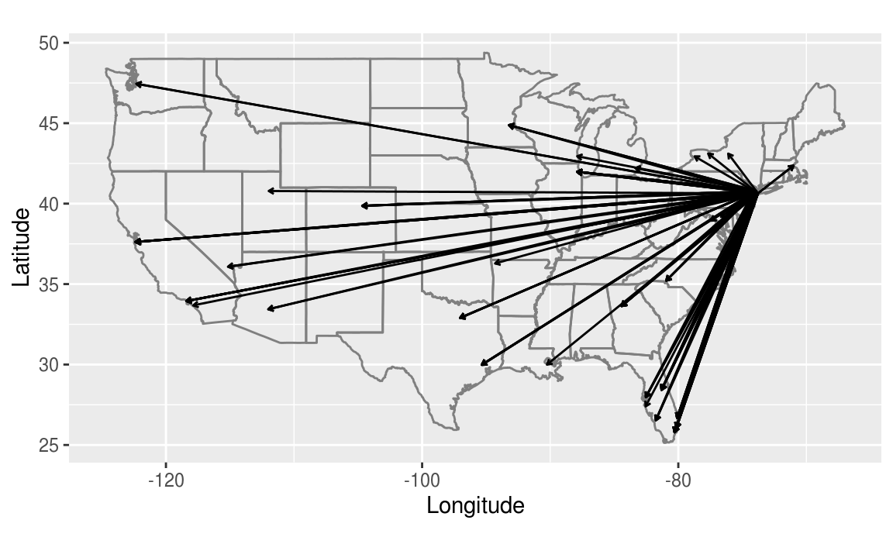
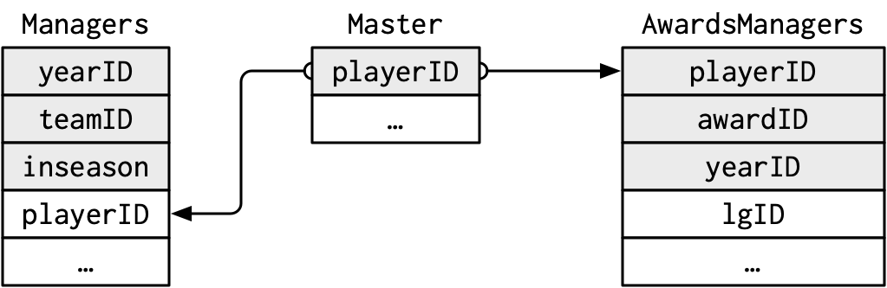
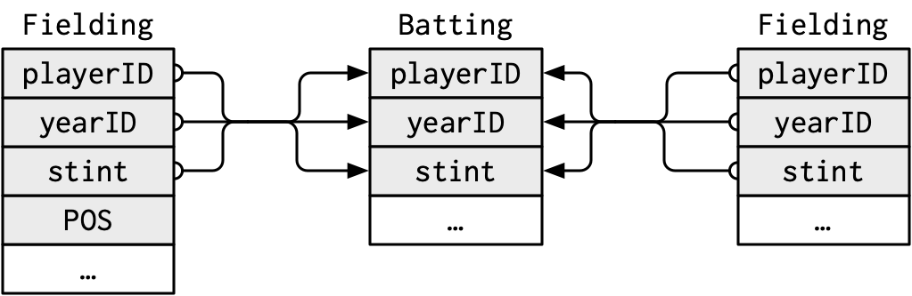
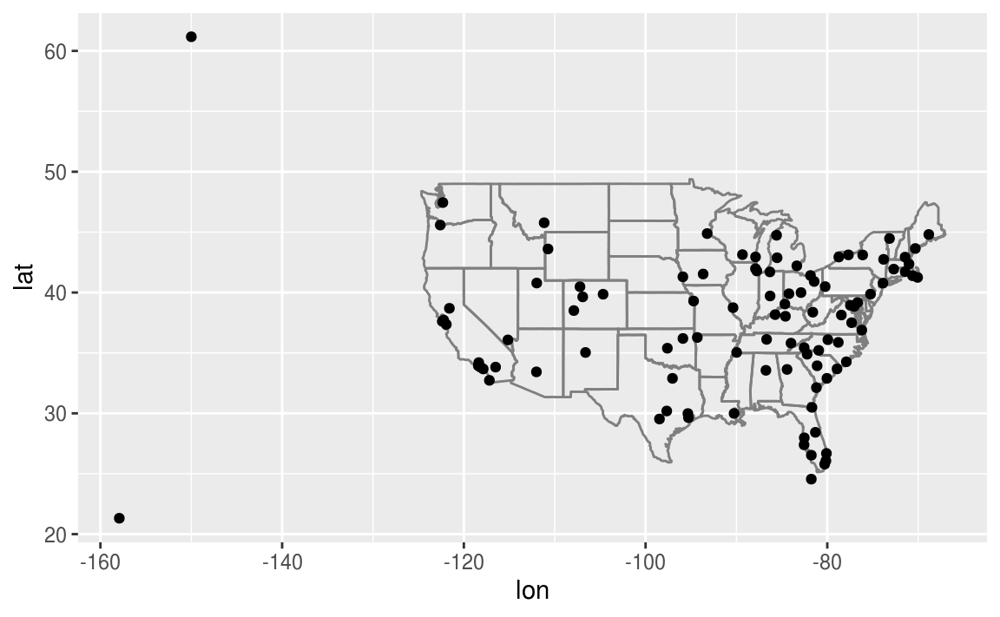
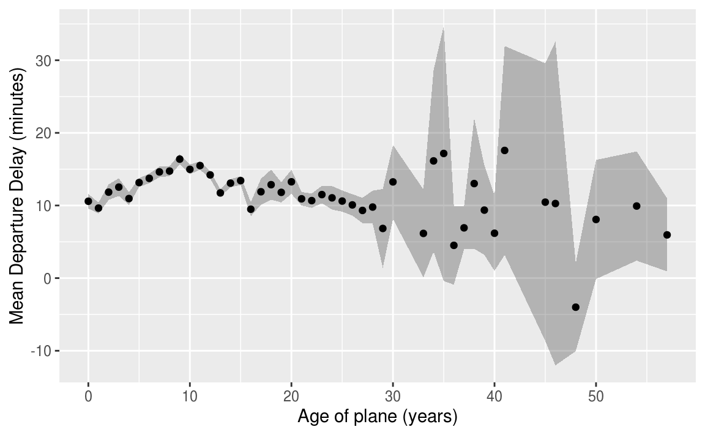
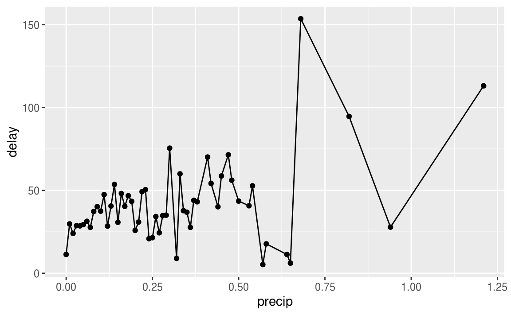

# Relational data

## Introduction


```r
library("tidyverse")
library("nycflights13")
```

The package datamodelr is used to draw database schema:

```r
library("datamodelr")
```

## nycflights13

### Exercise <span class="exercise-number">13.2.1.1</span> {.unnumbered .exercise}

<div class="question">
Imagine you wanted to draw (approximately) the route each plane flies from its origin to its destination. What variables would you need? What tables would you need to combine?
</div>

<div class="answer">

Drawing the approximate flight paths requires the latitude and longitude of the both the origin and destination airports of each flights.
This requires the `flights` and `airports` tables.
The `flights` table has the origin (`origin`) and destination (`dest`) airport of each flight.
The `airports` table has the longitude (`lon`) and latitude (`lat`) of each airport.
To get the latitude and longitude for the origin and destination of each flight,
requires two joins for `flights` to `airports`,
once for the latitude and longitude of the origin airport,
and once for the latitude and longitude of the destination airport.
I use an inner join in order to drop any flights with missing airports since they will not have a longitude or latitude.

```r
flights_latlon <- flights %>%
  inner_join(select(airports, origin = faa, origin_lat = lat, origin_lon = lon),
            by = "origin") %>%
  inner_join(select(airports, dest = faa, dest_lat = lat, dest_lon = lon),
            by = "dest")
```

This plots the approximate flight paths of the first 100 flights in the `flights` dataset.

```r
flights_latlon %>%
  slice(1:100) %>%
  ggplot(aes(x = origin_lon, xend = dest_lon,
             y = origin_lat, yend = dest_lat)) +
    borders("state") +
    geom_segment(arrow = arrow(length = unit(0.1,"cm"))) +
    coord_quickmap() +
    labs(y = "Latitude", x = "Longitude")
#> 
#> Attaching package: 'maps'
#> The following object is masked from 'package:purrr':
#> 
#>     map
```



</div>

### Exercise <span class="exercise-number">13.2.1.2</span> {.unnumbered .exercise}

<div class="question">
I forgot to draw the relationship between `weather` and `airports`. 
What is the relationship and how should it appear in the diagram?
</div>

<div class="answer">

The column `faa$airports` is a foreign key of `weather$origin`.

The following drawing updates the one in [Section 13.2](https://r4ds.had.co.nz/relational-data.html#nycflights13-relational).
The line representing the new relation between `weather` and `airports` is colored black.
The lines representing the old relations are gray and thinner.


</div>

### Exercise <span class="exercise-number">13.2.1.3</span> {.unnumbered .exercise}

<div class="question">
Weather only contains information for the origin (NYC) airports. If it contained weather records for all airports in the USA, what additional relation would it define with `flights`?
</div>

<div class="answer">

If the weather was included for all airports in the US, then it would provide the weather for the destination of each flight.
The `weather` data frame columns (`year`, `month`, `day`, `hour`, `origin`) are a foreign key for the `flights` data frame columns (`year`, `month`, `day`, `hour`, `dest`).
This would provide information about the weather at the destination airport at the time of the flight take off, unless the arrival date-time were calculated.

So why was this not a relationship prior to adding additional rows to the `weather` table?
In a foreign key relationship, the collection columns of columns in the child table 
must refer to a unique collection of columns in the parent table. 
When the `weather` table only contained New York airports,
there were many values of  (`year`, `month`, `day`, `hour`, `dest`) in `flights` that
did not appear in the `weather` table. Therefore, it was not a foreign key. It was only after
all combinations of year, month, day, hour, and airports that are defined in `flights`
were added to the `weather` table that there existed this relation between these tables.

</div>

### Exercise <span class="exercise-number">13.2.1.4</span> {.unnumbered .exercise}

<div class="question">
We know that some days of the year are “special”, and fewer people than usual fly on them. How might you represent that data as a data frame? What would be the primary keys of that table? How would it connect to the existing tables?
</div>

<div class="answer">

I would add a table of special dates.
Its primary key would be  `date`.
This would match to the `year`, `month`,
and `day` columns of `flights`.

The table would resemble the following:

```r
special_days <- tribble(
  ~year, ~month, ~day, ~holiday,
  2013, 01, 01, "New Years Day",
  2013, 07, 04, "Independence Day",
  2013, 11, 29, "Thanksgiving Day",
  2013, 12, 25, "Christmas Day"
)
```

</div>

## Keys

### Exercise <span class="exercise-number">13.3.1.1</span> {.unnumbered .exercise}

<div class="question">
Add a surrogate key to flights.
</div>

<div class="answer">

I add the column `flight_id` as a surrogate key.
I sort the data prior to making the key, even though it is not strictly necessary, so the order of the rows has some meaning.

```r
flights %>%
  arrange(year, month, day, sched_dep_time, carrier, flight) %>%
  mutate(flight_id = row_number()) %>%
  glimpse()
#> Observations: 336,776
#> Variables: 20
#> $ year           <int> 2013, 2013, 2013, 2013, 2013, 2013, 2013, 2013,...
#> $ month          <int> 1, 1, 1, 1, 1, 1, 1, 1, 1, 1, 1, 1, 1, 1, 1, 1,...
#> $ day            <int> 1, 1, 1, 1, 1, 1, 1, 1, 1, 1, 1, 1, 1, 1, 1, 1,...
#> $ dep_time       <int> 517, 533, 542, 544, 554, 559, 558, 559, 558, 55...
#> $ sched_dep_time <int> 515, 529, 540, 545, 558, 559, 600, 600, 600, 60...
#> $ dep_delay      <dbl> 2, 4, 2, -1, -4, 0, -2, -1, -2, -2, -3, NA, 1, ...
#> $ arr_time       <int> 830, 850, 923, 1004, 740, 702, 753, 941, 849, 8...
#> $ sched_arr_time <int> 819, 830, 850, 1022, 728, 706, 745, 910, 851, 8...
#> $ arr_delay      <dbl> 11, 20, 33, -18, 12, -4, 8, 31, -2, -3, -8, NA,...
#> $ carrier        <chr> "UA", "UA", "AA", "B6", "UA", "B6", "AA", "AA",...
#> $ flight         <int> 1545, 1714, 1141, 725, 1696, 1806, 301, 707, 49...
#> $ tailnum        <chr> "N14228", "N24211", "N619AA", "N804JB", "N39463...
#> $ origin         <chr> "EWR", "LGA", "JFK", "JFK", "EWR", "JFK", "LGA"...
#> $ dest           <chr> "IAH", "IAH", "MIA", "BQN", "ORD", "BOS", "ORD"...
#> $ air_time       <dbl> 227, 227, 160, 183, 150, 44, 138, 257, 149, 158...
#> $ distance       <dbl> 1400, 1416, 1089, 1576, 719, 187, 733, 1389, 10...
#> $ hour           <dbl> 5, 5, 5, 5, 5, 5, 6, 6, 6, 6, 6, 6, 6, 6, 6, 6,...
#> $ minute         <dbl> 15, 29, 40, 45, 58, 59, 0, 0, 0, 0, 0, 0, 0, 0,...
#> $ time_hour      <dttm> 2013-01-01 05:00:00, 2013-01-01 05:00:00, 2013...
#> $ flight_id      <int> 1, 2, 3, 4, 5, 6, 7, 8, 9, 10, 11, 12, 13, 14, ...
```

</div>

### Exercise <span class="exercise-number">13.3.1.2</span> {.unnumbered .exercise}

<div class="question">
Identify the keys in the following datasets

1.  `Lahman::Batting`
1.  `babynames::babynames`
1.  `nasaweather::atmos`
1.  `fueleconomy::vehicles`
1.  `ggplot2::diamonds`

(You might need to install some packages and read some documentation.)

</div>

<div class="answer">

The answer to each part follows.

1.  The primary key for `Lahman::Batting` is `playerID`, `yearID`, `stint`.
    It is not simply `playerID`, `yearID` because players can have different stints in different leagues within the same year.

    
    ```r
    Lahman::Batting %>%
      count(playerID, yearID, stint) %>%
      filter(n > 1) %>%
      nrow()
    #> [1] 0
    ```

1.  The primary key for `babynames::babynames` is `year`, `sex`, `name`.
    It is not simply `year`, `name` since names can appear for both sexes with different counts.

    
    ```r
    babynames::babynames %>%
      count(year, sex, name) %>%
      filter(nn > 1) %>%
      nrow()
    #> [1] 0
    ```
    You may notice that in this example, we filter on `nn` instead of `n`.
    In this example, the name of the column generated by `count()` is named `nn` 
    because the `babynames` data frame already contains a column named `n`.
    
    This behavior requires knowing the names of the columns which `count()` 
    is being called on. The following code uses `group_by()` and `n()` to 
    produces the same result.
    
    ```r
    babynames::babynames %>%
      group_by(year, sex, name) %>%
      filter(n() > 1) %>%
      nrow()
    #> [1] 0
    ```

1.  The primary key for `nasaweather::atmos` is the location and time of the measurement: `lat`, `long`, `year`, `month`.

    
    ```r
    nasaweather::atmos %>%
      count(lat, long, year, month) %>%
      filter(n > 1) %>%
      nrow()
    #> [1] 0
    ```

1.  The column `id` (unique EPA identifier) is the primary key for `fueleconomy::vehicles`:

    
    ```r
    fueleconomy::vehicles %>%
      count(id) %>%
      filter(n > 1) %>%
      nrow()
    #> [1] 0
    ```

1.  There is no primary key for `ggplot2::diamonds`.
    The number of distinct rows in the dataset is less than the total number of rows, which implies that there is no combination of variables uniquely identifies the observations.

    
    ```r
    ggplot2::diamonds %>%
      distinct() %>%
      nrow()
    #> [1] 53794
    nrow(ggplot2::diamonds)
    #> [1] 53940
    ```

</div>

### Exercise <span class="exercise-number">13.3.1.3</span> {.unnumbered .exercise}

<div class="question">
Draw a diagram illustrating the connections between the `Batting`, `Master`, and `Salaries` tables in the **Lahman** package. Draw another diagram that shows the relationship between `Master`, `Managers`, `AwardsManagers`.

How would you characterize the relationship between the `Batting`, `Pitching`, and `Fielding` tables?
</div>

<div class="answer">

For the `Batting`, `Master`, and `Salaries` tables:

-   `Master`

    -   Primary key: `playerID`

-   `Batting`

    -   Primary key: `playerID`, `yearID`, `stint`

    -   Foreign keys:

        -   `playerID` = `Master$playerID` (many-to-1)

-   `Salaries`

    -   Primary key: `yearID`, `teamID`, `playerID`

    -   Foreign keys:

        -   `playerID` = `Master$playerID` (many-to-1)

The columns `teamID` and `lgID` are not foreign keys even though they appear in multiple tables (with the same meaning) because they are not primary keys for any of the tables considered in this exercise.
The `teamID` variable references `Teams$teamID`, and `lgID` does not have its own table.

*R for Data Science* uses database schema diagrams to illustrate relations between the tables
Most flowchart or diagramming software can be used used to create database schema diagrams, as well as some specialized database software.
The diagrams in *R for Data Science* were created with [OmniGraffle](https://www.gliffy.com/), and their sources can be found in its [GitHub repository](https://github.com/hadley/r4ds/tree/master/diagrams).

The following diagram was created with OmniGraffle in the same style as those 
in *R for Data Science* . 
It shows the relations between the `Master`, `Batting` and `Salaries` tables.


Another option to draw database schema diagrams is the R package [datamodelr](https://github.com/bergant/datamodelr), which can programmatically create database schema diagrams.
The following code uses **datamodelr** to draw a diagram of the relations between the `Batting`, `Master`, and `Salaries` tables.


```r
dm1 <- dm_from_data_frames(list(Batting = Lahman::Batting,
                                Master = Lahman::Master,
                                Salaries = Lahman::Salaries)) %>%
  dm_set_key("Batting", c("playerID", "yearID", "stint")) %>%
  dm_set_key("Master", "playerID") %>%
  dm_set_key("Salaries", c("yearID", "teamID", "playerID")) %>%
  dm_add_references(
    Batting$playerID == Master$playerID,
    Salaries$playerID == Master$playerID
  )

dm_create_graph(dm1, rankdir = "LR", columnArrows = TRUE) %>%
  dm_render_graph()
```

<!--html_preserve--><div id="htmlwidget-14d5992801777f4abbc5" style="width:70%;height:355.968px;" class="grViz html-widget"></div>
<script type="application/json" data-for="htmlwidget-14d5992801777f4abbc5">{"x":{"diagram":"#data_model\ndigraph {\ngraph [rankdir=LR tooltip=\"Data Model\" ]\n\nnode [margin=0 fontcolor = \"#444444\" ]\n\nedge [color = \"#555555\", arrowsize = 1, ]\n\n\n  \"Batting\" [label = <<TABLE ALIGN=\"LEFT\" BORDER=\"1\" CELLBORDER=\"0\" CELLSPACING=\"0\" COLOR=\"#555555\">\n    <TR>\n      <TD COLSPAN=\"1\" BGCOLOR=\"#EFEBDD\" BORDER=\"0\"><FONT COLOR=\"#000000\">Batting<\/FONT>\n<\/TD>\n    <\/TR>\n    <TR>\n      <TD ALIGN=\"LEFT\" BGCOLOR=\"#FFFFFF\" PORT=\"playerID\"><U>playerID<\/U><\/TD>\n    <\/TR>\n    <TR>\n      <TD ALIGN=\"LEFT\" BGCOLOR=\"#FFFFFF\" PORT=\"yearID\"><U>yearID<\/U><\/TD>\n    <\/TR>\n    <TR>\n      <TD ALIGN=\"LEFT\" BGCOLOR=\"#FFFFFF\" PORT=\"stint\"><U>stint<\/U><\/TD>\n    <\/TR>\n    <TR>\n      <TD ALIGN=\"LEFT\" BGCOLOR=\"#FFFFFF\">teamID<\/TD>\n    <\/TR>\n    <TR>\n      <TD ALIGN=\"LEFT\" BGCOLOR=\"#FFFFFF\">lgID<\/TD>\n    <\/TR>\n    <TR>\n      <TD ALIGN=\"LEFT\" BGCOLOR=\"#FFFFFF\">G<\/TD>\n    <\/TR>\n    <TR>\n      <TD ALIGN=\"LEFT\" BGCOLOR=\"#FFFFFF\">AB<\/TD>\n    <\/TR>\n    <TR>\n      <TD ALIGN=\"LEFT\" BGCOLOR=\"#FFFFFF\">R<\/TD>\n    <\/TR>\n    <TR>\n      <TD ALIGN=\"LEFT\" BGCOLOR=\"#FFFFFF\">H<\/TD>\n    <\/TR>\n    <TR>\n      <TD ALIGN=\"LEFT\" BGCOLOR=\"#FFFFFF\">X2B<\/TD>\n    <\/TR>\n    <TR>\n      <TD ALIGN=\"LEFT\" BGCOLOR=\"#FFFFFF\">X3B<\/TD>\n    <\/TR>\n    <TR>\n      <TD ALIGN=\"LEFT\" BGCOLOR=\"#FFFFFF\">HR<\/TD>\n    <\/TR>\n    <TR>\n      <TD ALIGN=\"LEFT\" BGCOLOR=\"#FFFFFF\">RBI<\/TD>\n    <\/TR>\n    <TR>\n      <TD ALIGN=\"LEFT\" BGCOLOR=\"#FFFFFF\">SB<\/TD>\n    <\/TR>\n    <TR>\n      <TD ALIGN=\"LEFT\" BGCOLOR=\"#FFFFFF\">CS<\/TD>\n    <\/TR>\n    <TR>\n      <TD ALIGN=\"LEFT\" BGCOLOR=\"#FFFFFF\">BB<\/TD>\n    <\/TR>\n    <TR>\n      <TD ALIGN=\"LEFT\" BGCOLOR=\"#FFFFFF\">SO<\/TD>\n    <\/TR>\n    <TR>\n      <TD ALIGN=\"LEFT\" BGCOLOR=\"#FFFFFF\">IBB<\/TD>\n    <\/TR>\n    <TR>\n      <TD ALIGN=\"LEFT\" BGCOLOR=\"#FFFFFF\">HBP<\/TD>\n    <\/TR>\n    <TR>\n      <TD ALIGN=\"LEFT\" BGCOLOR=\"#FFFFFF\">SH<\/TD>\n    <\/TR>\n    <TR>\n      <TD ALIGN=\"LEFT\" BGCOLOR=\"#FFFFFF\">SF<\/TD>\n    <\/TR>\n    <TR>\n      <TD ALIGN=\"LEFT\" BGCOLOR=\"#FFFFFF\">GIDP<\/TD>\n    <\/TR>\n  <\/TABLE>>, shape = \"plaintext\"] \n\n  \"Master\" [label = <<TABLE ALIGN=\"LEFT\" BORDER=\"1\" CELLBORDER=\"0\" CELLSPACING=\"0\" COLOR=\"#555555\">\n    <TR>\n      <TD COLSPAN=\"1\" BGCOLOR=\"#EFEBDD\" BORDER=\"0\"><FONT COLOR=\"#000000\">Master<\/FONT>\n<\/TD>\n    <\/TR>\n    <TR>\n      <TD ALIGN=\"LEFT\" BGCOLOR=\"#FFFFFF\" PORT=\"playerID\"><U>playerID<\/U><\/TD>\n    <\/TR>\n    <TR>\n      <TD ALIGN=\"LEFT\" BGCOLOR=\"#FFFFFF\">birthYear<\/TD>\n    <\/TR>\n    <TR>\n      <TD ALIGN=\"LEFT\" BGCOLOR=\"#FFFFFF\">birthMonth<\/TD>\n    <\/TR>\n    <TR>\n      <TD ALIGN=\"LEFT\" BGCOLOR=\"#FFFFFF\">birthDay<\/TD>\n    <\/TR>\n    <TR>\n      <TD ALIGN=\"LEFT\" BGCOLOR=\"#FFFFFF\">birthCountry<\/TD>\n    <\/TR>\n    <TR>\n      <TD ALIGN=\"LEFT\" BGCOLOR=\"#FFFFFF\">birthState<\/TD>\n    <\/TR>\n    <TR>\n      <TD ALIGN=\"LEFT\" BGCOLOR=\"#FFFFFF\">birthCity<\/TD>\n    <\/TR>\n    <TR>\n      <TD ALIGN=\"LEFT\" BGCOLOR=\"#FFFFFF\">deathYear<\/TD>\n    <\/TR>\n    <TR>\n      <TD ALIGN=\"LEFT\" BGCOLOR=\"#FFFFFF\">deathMonth<\/TD>\n    <\/TR>\n    <TR>\n      <TD ALIGN=\"LEFT\" BGCOLOR=\"#FFFFFF\">deathDay<\/TD>\n    <\/TR>\n    <TR>\n      <TD ALIGN=\"LEFT\" BGCOLOR=\"#FFFFFF\">deathCountry<\/TD>\n    <\/TR>\n    <TR>\n      <TD ALIGN=\"LEFT\" BGCOLOR=\"#FFFFFF\">deathState<\/TD>\n    <\/TR>\n    <TR>\n      <TD ALIGN=\"LEFT\" BGCOLOR=\"#FFFFFF\">deathCity<\/TD>\n    <\/TR>\n    <TR>\n      <TD ALIGN=\"LEFT\" BGCOLOR=\"#FFFFFF\">nameFirst<\/TD>\n    <\/TR>\n    <TR>\n      <TD ALIGN=\"LEFT\" BGCOLOR=\"#FFFFFF\">nameLast<\/TD>\n    <\/TR>\n    <TR>\n      <TD ALIGN=\"LEFT\" BGCOLOR=\"#FFFFFF\">nameGiven<\/TD>\n    <\/TR>\n    <TR>\n      <TD ALIGN=\"LEFT\" BGCOLOR=\"#FFFFFF\">weight<\/TD>\n    <\/TR>\n    <TR>\n      <TD ALIGN=\"LEFT\" BGCOLOR=\"#FFFFFF\">height<\/TD>\n    <\/TR>\n    <TR>\n      <TD ALIGN=\"LEFT\" BGCOLOR=\"#FFFFFF\">bats<\/TD>\n    <\/TR>\n    <TR>\n      <TD ALIGN=\"LEFT\" BGCOLOR=\"#FFFFFF\">throws<\/TD>\n    <\/TR>\n    <TR>\n      <TD ALIGN=\"LEFT\" BGCOLOR=\"#FFFFFF\">debut<\/TD>\n    <\/TR>\n    <TR>\n      <TD ALIGN=\"LEFT\" BGCOLOR=\"#FFFFFF\">finalGame<\/TD>\n    <\/TR>\n    <TR>\n      <TD ALIGN=\"LEFT\" BGCOLOR=\"#FFFFFF\">retroID<\/TD>\n    <\/TR>\n    <TR>\n      <TD ALIGN=\"LEFT\" BGCOLOR=\"#FFFFFF\">bbrefID<\/TD>\n    <\/TR>\n    <TR>\n      <TD ALIGN=\"LEFT\" BGCOLOR=\"#FFFFFF\">deathDate<\/TD>\n    <\/TR>\n    <TR>\n      <TD ALIGN=\"LEFT\" BGCOLOR=\"#FFFFFF\">birthDate<\/TD>\n    <\/TR>\n  <\/TABLE>>, shape = \"plaintext\"] \n\n  \"Salaries\" [label = <<TABLE ALIGN=\"LEFT\" BORDER=\"1\" CELLBORDER=\"0\" CELLSPACING=\"0\" COLOR=\"#555555\">\n    <TR>\n      <TD COLSPAN=\"1\" BGCOLOR=\"#EFEBDD\" BORDER=\"0\"><FONT COLOR=\"#000000\">Salaries<\/FONT>\n<\/TD>\n    <\/TR>\n    <TR>\n      <TD ALIGN=\"LEFT\" BGCOLOR=\"#FFFFFF\" PORT=\"yearID\"><U>yearID<\/U><\/TD>\n    <\/TR>\n    <TR>\n      <TD ALIGN=\"LEFT\" BGCOLOR=\"#FFFFFF\" PORT=\"teamID\"><U>teamID<\/U><\/TD>\n    <\/TR>\n    <TR>\n      <TD ALIGN=\"LEFT\" BGCOLOR=\"#FFFFFF\">lgID<\/TD>\n    <\/TR>\n    <TR>\n      <TD ALIGN=\"LEFT\" BGCOLOR=\"#FFFFFF\" PORT=\"playerID\"><U>playerID<\/U><\/TD>\n    <\/TR>\n    <TR>\n      <TD ALIGN=\"LEFT\" BGCOLOR=\"#FFFFFF\">salary<\/TD>\n    <\/TR>\n  <\/TABLE>>, shape = \"plaintext\"] \n\n\"Batting\":\"playerID\"->\"Master\":\"playerID\"\n\"Salaries\":\"playerID\"->\"Master\":\"playerID\"\n}","config":{"engine":null,"options":null}},"evals":[],"jsHooks":[]}</script><!--/html_preserve-->

For the `Master`, `Manager`, and `AwardsManagers` tables:

-   `Master`

    -   Primary key: `playerID`

-   `Managers`

    -   Primary key: `yearID`, `teamID`, `inseason`

    -   Foreign keys:

        -   `playerID` references `Master$playerID` (many-to-1)

-   `AwardsManagers`:

    -   Primary key: `playerID`, `awardID`, `yearID`

    -   Foreign keys:

        -   `playerID` references `Master$playerID` (many-to-1)

For `AwardsManagers`, the columns (`awardID`, `yearID`, `lgID`) are not a primary
key because there can be, and have been ties, as indicated by the `tie` variable.

The relations between the `Master`, `Managers`, and `AwardsManagers` tables
are shown in the following two diagrams: the first created manually with OmniGraffle,
and the second programmatically in R with the **datamodelr** package.




```r
dm2 <- dm_from_data_frames(list(Master = Lahman::Master,
                                Managers = Lahman::Managers,
                                AwardsManagers = Lahman::AwardsManagers)) %>%
  dm_set_key("Master", "playerID") %>%
  dm_set_key("Managers", c("yearID", "teamID", "inseason")) %>%
  dm_set_key("AwardsManagers", c("playerID", "awardID", "yearID")) %>%
  dm_add_references(
    Managers$playerID == Master$playerID,
    AwardsManagers$playerID == Master$playerID
  )

dm_create_graph(dm2, rankdir = "LR", columnArrows = TRUE) %>%
  dm_render_graph()
```

<!--html_preserve--><div id="htmlwidget-df2c08526632671063f9" style="width:70%;height:355.968px;" class="grViz html-widget"></div>
<script type="application/json" data-for="htmlwidget-df2c08526632671063f9">{"x":{"diagram":"#data_model\ndigraph {\ngraph [rankdir=LR tooltip=\"Data Model\" ]\n\nnode [margin=0 fontcolor = \"#444444\" ]\n\nedge [color = \"#555555\", arrowsize = 1, ]\n\n\n  \"AwardsManagers\" [label = <<TABLE ALIGN=\"LEFT\" BORDER=\"1\" CELLBORDER=\"0\" CELLSPACING=\"0\" COLOR=\"#555555\">\n    <TR>\n      <TD COLSPAN=\"1\" BGCOLOR=\"#EFEBDD\" BORDER=\"0\"><FONT COLOR=\"#000000\">AwardsManagers<\/FONT>\n<\/TD>\n    <\/TR>\n    <TR>\n      <TD ALIGN=\"LEFT\" BGCOLOR=\"#FFFFFF\" PORT=\"playerID\"><U>playerID<\/U><\/TD>\n    <\/TR>\n    <TR>\n      <TD ALIGN=\"LEFT\" BGCOLOR=\"#FFFFFF\" PORT=\"awardID\"><U>awardID<\/U><\/TD>\n    <\/TR>\n    <TR>\n      <TD ALIGN=\"LEFT\" BGCOLOR=\"#FFFFFF\" PORT=\"yearID\"><U>yearID<\/U><\/TD>\n    <\/TR>\n    <TR>\n      <TD ALIGN=\"LEFT\" BGCOLOR=\"#FFFFFF\">lgID<\/TD>\n    <\/TR>\n    <TR>\n      <TD ALIGN=\"LEFT\" BGCOLOR=\"#FFFFFF\">tie<\/TD>\n    <\/TR>\n    <TR>\n      <TD ALIGN=\"LEFT\" BGCOLOR=\"#FFFFFF\">notes<\/TD>\n    <\/TR>\n  <\/TABLE>>, shape = \"plaintext\"] \n\n  \"Managers\" [label = <<TABLE ALIGN=\"LEFT\" BORDER=\"1\" CELLBORDER=\"0\" CELLSPACING=\"0\" COLOR=\"#555555\">\n    <TR>\n      <TD COLSPAN=\"1\" BGCOLOR=\"#EFEBDD\" BORDER=\"0\"><FONT COLOR=\"#000000\">Managers<\/FONT>\n<\/TD>\n    <\/TR>\n    <TR>\n      <TD ALIGN=\"LEFT\" BGCOLOR=\"#FFFFFF\" PORT=\"playerID\">playerID<\/TD>\n    <\/TR>\n    <TR>\n      <TD ALIGN=\"LEFT\" BGCOLOR=\"#FFFFFF\" PORT=\"yearID\"><U>yearID<\/U><\/TD>\n    <\/TR>\n    <TR>\n      <TD ALIGN=\"LEFT\" BGCOLOR=\"#FFFFFF\" PORT=\"teamID\"><U>teamID<\/U><\/TD>\n    <\/TR>\n    <TR>\n      <TD ALIGN=\"LEFT\" BGCOLOR=\"#FFFFFF\">lgID<\/TD>\n    <\/TR>\n    <TR>\n      <TD ALIGN=\"LEFT\" BGCOLOR=\"#FFFFFF\" PORT=\"inseason\"><U>inseason<\/U><\/TD>\n    <\/TR>\n    <TR>\n      <TD ALIGN=\"LEFT\" BGCOLOR=\"#FFFFFF\">G<\/TD>\n    <\/TR>\n    <TR>\n      <TD ALIGN=\"LEFT\" BGCOLOR=\"#FFFFFF\">W<\/TD>\n    <\/TR>\n    <TR>\n      <TD ALIGN=\"LEFT\" BGCOLOR=\"#FFFFFF\">L<\/TD>\n    <\/TR>\n    <TR>\n      <TD ALIGN=\"LEFT\" BGCOLOR=\"#FFFFFF\">rank<\/TD>\n    <\/TR>\n    <TR>\n      <TD ALIGN=\"LEFT\" BGCOLOR=\"#FFFFFF\">plyrMgr<\/TD>\n    <\/TR>\n  <\/TABLE>>, shape = \"plaintext\"] \n\n  \"Master\" [label = <<TABLE ALIGN=\"LEFT\" BORDER=\"1\" CELLBORDER=\"0\" CELLSPACING=\"0\" COLOR=\"#555555\">\n    <TR>\n      <TD COLSPAN=\"1\" BGCOLOR=\"#EFEBDD\" BORDER=\"0\"><FONT COLOR=\"#000000\">Master<\/FONT>\n<\/TD>\n    <\/TR>\n    <TR>\n      <TD ALIGN=\"LEFT\" BGCOLOR=\"#FFFFFF\" PORT=\"playerID\"><U>playerID<\/U><\/TD>\n    <\/TR>\n    <TR>\n      <TD ALIGN=\"LEFT\" BGCOLOR=\"#FFFFFF\">birthYear<\/TD>\n    <\/TR>\n    <TR>\n      <TD ALIGN=\"LEFT\" BGCOLOR=\"#FFFFFF\">birthMonth<\/TD>\n    <\/TR>\n    <TR>\n      <TD ALIGN=\"LEFT\" BGCOLOR=\"#FFFFFF\">birthDay<\/TD>\n    <\/TR>\n    <TR>\n      <TD ALIGN=\"LEFT\" BGCOLOR=\"#FFFFFF\">birthCountry<\/TD>\n    <\/TR>\n    <TR>\n      <TD ALIGN=\"LEFT\" BGCOLOR=\"#FFFFFF\">birthState<\/TD>\n    <\/TR>\n    <TR>\n      <TD ALIGN=\"LEFT\" BGCOLOR=\"#FFFFFF\">birthCity<\/TD>\n    <\/TR>\n    <TR>\n      <TD ALIGN=\"LEFT\" BGCOLOR=\"#FFFFFF\">deathYear<\/TD>\n    <\/TR>\n    <TR>\n      <TD ALIGN=\"LEFT\" BGCOLOR=\"#FFFFFF\">deathMonth<\/TD>\n    <\/TR>\n    <TR>\n      <TD ALIGN=\"LEFT\" BGCOLOR=\"#FFFFFF\">deathDay<\/TD>\n    <\/TR>\n    <TR>\n      <TD ALIGN=\"LEFT\" BGCOLOR=\"#FFFFFF\">deathCountry<\/TD>\n    <\/TR>\n    <TR>\n      <TD ALIGN=\"LEFT\" BGCOLOR=\"#FFFFFF\">deathState<\/TD>\n    <\/TR>\n    <TR>\n      <TD ALIGN=\"LEFT\" BGCOLOR=\"#FFFFFF\">deathCity<\/TD>\n    <\/TR>\n    <TR>\n      <TD ALIGN=\"LEFT\" BGCOLOR=\"#FFFFFF\">nameFirst<\/TD>\n    <\/TR>\n    <TR>\n      <TD ALIGN=\"LEFT\" BGCOLOR=\"#FFFFFF\">nameLast<\/TD>\n    <\/TR>\n    <TR>\n      <TD ALIGN=\"LEFT\" BGCOLOR=\"#FFFFFF\">nameGiven<\/TD>\n    <\/TR>\n    <TR>\n      <TD ALIGN=\"LEFT\" BGCOLOR=\"#FFFFFF\">weight<\/TD>\n    <\/TR>\n    <TR>\n      <TD ALIGN=\"LEFT\" BGCOLOR=\"#FFFFFF\">height<\/TD>\n    <\/TR>\n    <TR>\n      <TD ALIGN=\"LEFT\" BGCOLOR=\"#FFFFFF\">bats<\/TD>\n    <\/TR>\n    <TR>\n      <TD ALIGN=\"LEFT\" BGCOLOR=\"#FFFFFF\">throws<\/TD>\n    <\/TR>\n    <TR>\n      <TD ALIGN=\"LEFT\" BGCOLOR=\"#FFFFFF\">debut<\/TD>\n    <\/TR>\n    <TR>\n      <TD ALIGN=\"LEFT\" BGCOLOR=\"#FFFFFF\">finalGame<\/TD>\n    <\/TR>\n    <TR>\n      <TD ALIGN=\"LEFT\" BGCOLOR=\"#FFFFFF\">retroID<\/TD>\n    <\/TR>\n    <TR>\n      <TD ALIGN=\"LEFT\" BGCOLOR=\"#FFFFFF\">bbrefID<\/TD>\n    <\/TR>\n    <TR>\n      <TD ALIGN=\"LEFT\" BGCOLOR=\"#FFFFFF\">deathDate<\/TD>\n    <\/TR>\n    <TR>\n      <TD ALIGN=\"LEFT\" BGCOLOR=\"#FFFFFF\">birthDate<\/TD>\n    <\/TR>\n  <\/TABLE>>, shape = \"plaintext\"] \n\n\"Managers\":\"playerID\"->\"Master\":\"playerID\"\n\"AwardsManagers\":\"playerID\"->\"Master\":\"playerID\"\n}","config":{"engine":null,"options":null}},"evals":[],"jsHooks":[]}</script><!--/html_preserve-->

The primary keys of `Batting`, `Pitching`, and `Fielding` are the following:

-   `Batting`: (`playerID`, `yearID`, `stint`)
-   `Pitching`: (`playerID`, `yearID`, `stint`)
-   `Fielding`: (`playerID`, `yearID`, `stint`, `POS`).

While `Batting` and `Pitching` has one row per player, year, stint, the `Fielding`
table has additional rows for each position (`POS`) a player played within a stint.

Since `Batting`, `Pitching`, and `Fielding` all share the `playerID`, `yearID`, and `stint`
we would expect some foreign key relations between these tables.
The columns (`playerID`, `yearID`, `stint`) in `Pitching` are a foreign key which
references the same columns in `Batting`. We can check this by checking that
all observed combinations of values of these columns appearing in `Pitching`
also appear in `Batting`. To do this I use an anti-join, which is discussed
in the section [Filtering Joins](https://r4ds.had.co.nz/relational-data.html#filtering-joins).

```r
nrow(anti_join(Lahman::Pitching, Lahman::Batting, 
               by = c("playerID", "yearID", "stint")))
#> [1] 0
```
Similarly, the columns (`playerID`, `yearID`, `stint`) in `Fielding` are a foreign key which references the same columns in `Batting`.

```r
nrow(anti_join(Lahman::Fielding, Lahman::Batting,
               by = c("playerID", "yearID", "stint")))
#> [1] 0
```

The following diagram shows the relations between the `Batting`, `Pitching`, and
`Fielding` tables.



</div>

## Mutating Joins


```r
flights2 <- flights %>%
  select(year:day, hour, origin, dest, tailnum, carrier)
```

### Exercise <span class="exercise-number">13.4.6.1</span> {.unnumbered .exercise}

<div class="question">
Compute the average delay by destination, then join on the `airports` data frame so you can show the spatial distribution of delays. Here’s an easy way to draw a map of the United States:


```r
airports %>%
  semi_join(flights, c("faa" = "dest")) %>%
  ggplot(aes(lon, lat)) +
    borders("state") +
    geom_point() +
    coord_quickmap()
```



(Don’t worry if you don’t understand what `semi_join()` does — you’ll learn about it next.)

You might want to use the size or color of the points to display the average delay for each airport.

</div>

<div class="answer">


```r
avg_dest_delays <-
  flights %>%
  group_by(dest) %>%
  # arrival delay NA's are cancelled flights
  summarise(delay = mean(arr_delay, na.rm = TRUE)) %>%
  inner_join(airports, by = c(dest = "faa"))
```

```r
avg_dest_delays %>%
  ggplot(aes(lon, lat, colour = delay)) +
    borders("state") +
    geom_point() +
    coord_quickmap()
```


</div>

### Exercise <span class="exercise-number">13.4.6.2</span> {.unnumbered .exercise}

<div class="question">
Add the location of the origin and destination (i.e. the `lat` and `lon`) to `flights`.
</div>

<div class="answer">

You can perform one join after another. If duplicate variables are found, by default, dplyr will distinguish the two by adding `.x`, and `.y` to the ends of the variable names to solve naming conflicts.

```r
airport_locations <- airports %>%
  select(faa, lat, lon)

flights %>%
    select(year:day, hour, origin, dest) %>%
  left_join(
    airport_locations,
    by = c("origin" = "faa")
  ) %>%
  left_join(
    airport_locations,
    by = c("dest" = "faa")
  )
#> # A tibble: 336,776 x 10
#>    year month   day  hour origin dest  lat.x lon.x lat.y lon.y
#>   <int> <int> <int> <dbl> <chr>  <chr> <dbl> <dbl> <dbl> <dbl>
#> 1  2013     1     1     5 EWR    IAH    40.7 -74.2  30.0 -95.3
#> 2  2013     1     1     5 LGA    IAH    40.8 -73.9  30.0 -95.3
#> 3  2013     1     1     5 JFK    MIA    40.6 -73.8  25.8 -80.3
#> 4  2013     1     1     5 JFK    BQN    40.6 -73.8  NA    NA  
#> 5  2013     1     1     6 LGA    ATL    40.8 -73.9  33.6 -84.4
#> 6  2013     1     1     5 EWR    ORD    40.7 -74.2  42.0 -87.9
#> # ... with 3.368e+05 more rows
```
This however, this default can be over-ridden using the `suffix` argument.
It is always good practice to have clear variable names, so I will use the 
suffixes `"_dest"` and `"_origin`" to specify whether the column refers to 
the destination or origin airport.

```r
airport_locations <- airports %>%
  select(faa, lat, lon)

flights %>%
    select(year:day, hour, origin, dest) %>%
  left_join(
    airport_locations,
    by = c("origin" = "faa")
  ) %>%
  left_join(
    airport_locations,
    by = c("dest" = "faa"),
    suffix = c("_origin", "_dest")
    # existing lat and lon variables in tibble gain the _origin suffix
    # new lat and lon variables are given _dest suffix
  )
#> # A tibble: 336,776 x 10
#>    year month   day  hour origin dest  lat_origin lon_origin lat_dest
#>   <int> <int> <int> <dbl> <chr>  <chr>      <dbl>      <dbl>    <dbl>
#> 1  2013     1     1     5 EWR    IAH         40.7      -74.2     30.0
#> 2  2013     1     1     5 LGA    IAH         40.8      -73.9     30.0
#> 3  2013     1     1     5 JFK    MIA         40.6      -73.8     25.8
#> 4  2013     1     1     5 JFK    BQN         40.6      -73.8     NA  
#> 5  2013     1     1     6 LGA    ATL         40.8      -73.9     33.6
#> 6  2013     1     1     5 EWR    ORD         40.7      -74.2     42.0
#> # ... with 3.368e+05 more rows, and 1 more variable: lon_dest <dbl>
```

</div>

### Exercise <span class="exercise-number">13.4.6.3</span> {.unnumbered .exercise}

<div class="question">
Is there a relationship between the age of a plane and its delays?
</div>

<div class="answer">

The question does not specify whether the relationship is with departure delay
or arrival delay. I will look at both.

To compare the age of the plane to flights delay, I merge `flights` with
the `planes`, which contains a variable `plane_year`, with the year in which the 
plane was built. To look at the relationship between plane age and departure
delay, I will calculate the average arrival and departure delay for each age 
of a flight.

```r
plane_cohorts <- inner_join(flights,
           select(planes, tailnum, plane_year = year), 
           by = "tailnum") %>%
  mutate(age = year - plane_year) %>%
  filter(!is.na(age)) %>%
  group_by(age) %>%
  summarise(dep_delay_mean = mean(dep_delay, na.rm = TRUE),
            dep_delay_sd = sd(dep_delay, na.rm = TRUE),
            arr_delay_mean = mean(arr_delay, na.rm = TRUE),
            arr_delay_sd = sd(arr_delay, na.rm = TRUE),
            n = n())
```

I will look for a relationship between departure delay and age by plotting 
age against the average departure delay. The average departure delay is increasing
for planes with ages up until 10 years. After that the departure delay decreases 
or levels off. The decrease in departure delay could be because older planes
with many mechanical issues are removed from service or because air lines schedule
these planes with enough time so that mechanical issues do not delay them.
There are few planes older than 30 years, so the relationship is mostly noise
after that.


```r
ggplot(plane_cohorts, aes(x = age, y = dep_delay_mean)) +
  geom_ribbon(mapping = aes(ymin = dep_delay_mean - 
                              2 * dep_delay_sd / sqrt(n), 
                            ymax = dep_delay_mean + 
                              2 * dep_delay_sd / sqrt(n)),
              alpha = 0.3) +
  geom_point() +
  scale_x_continuous("Age of plane (years)", breaks = seq(0, 50, by = 10)) +
  scale_y_continuous("Mean Departure Delay (minutes)")
```



There is a similar relationship in arrival delays. Delays increase with the age 
of the plane until ten years, then it declines and flattens out.

```r
ggplot(plane_cohorts, aes(x = age, y = arr_delay_mean)) +
  geom_ribbon(mapping = aes(ymin = arr_delay_mean - 
                              2 * arr_delay_sd / sqrt(n), 
                            ymax = arr_delay_mean + 
                              2 * arr_delay_sd / sqrt(n)),
              alpha = 0.3) +
  geom_point() +
  scale_x_continuous("Age of Plane (years)", breaks = seq(0, 50, by = 10)) +
  scale_y_continuous("Mean Arrival Delay (minutes)")
```


</div>

### Exercise <span class="exercise-number">13.4.6.4</span> {.unnumbered .exercise}

<div class="question">
What weather conditions make it more likely to see a delay?
</div>

<div class="answer">

Almost any amount of precipitation is associated with a delay.
However, there is not a strong a trend above 0.02 in. of precipitation.

```r
flight_weather <-
  flights %>%
  inner_join(weather, by = c("origin" = "origin",
                            "year" = "year",
                            "month" = "month",
                            "day" = "day",
                            "hour" = "hour"))

flight_weather %>%
  group_by(precip) %>%
  summarise(delay = mean(dep_delay, na.rm = TRUE)) %>%
  ggplot(aes(x = precip, y = delay)) +
    geom_line() + geom_point()
```



</div>

### Exercise <span class="exercise-number">13.4.6.5</span> {.unnumbered .exercise}

<div class="question">
What happened on June 13, 2013? Display the spatial pattern of delays, and then use Google to cross-reference with the weather.
</div>

<div class="answer">

There was a large series of storms (derechos) in the southeastern US (see [June 12-13, 2013 derecho series](https://en.wikipedia.org/wiki/June_12%E2%80%9313,_2013_derecho_series))

The largest delays are in Tennessee (Nashville), the Southeast, and the Midwest, which were the locations of the derechos:

```r
library(viridis)
#> Loading required package: viridisLite
flights %>%
  filter(year == 2013, month == 6, day == 13) %>%
  group_by(dest) %>%
  summarise(delay = mean(arr_delay, na.rm = TRUE)) %>%
  inner_join(airports, by = c("dest" = "faa")) %>%
  ggplot(aes(y = lat, x = lon, size = delay, colour = delay)) +
  borders("state") +
  geom_point() +
  coord_quickmap() +
  scale_colour_viridis()
#> Warning: Removed 3 rows containing missing values (geom_point).
```


</div>

## Filtering Joins

### Exercise <span class="exercise-number">13.5.1.1</span> {.unnumbered .exercise}

<div class="question">
What does it mean for a flight to have a missing `tailnum`? What do the tail numbers that don’t have a matching record in planes have in common? (Hint: one variable explains ~90% of the problems.)
</div>

<div class="answer">

American Airlines (AA) and Envoy Airlines (MQ) don't report tail numbers.

```r
flights %>%
  anti_join(planes, by = "tailnum") %>%
  count(carrier, sort = TRUE)
#> # A tibble: 10 x 2
#>   carrier     n
#>   <chr>   <int>
#> 1 MQ      25397
#> 2 AA      22558
#> 3 UA       1693
#> 4 9E       1044
#> 5 B6        830
#> 6 US        699
#> # ... with 4 more rows
```

</div>

### Exercise <span class="exercise-number">13.5.1.2</span> {.unnumbered .exercise}

<div class="question">
Filter flights to only show flights with planes that have flown at least 100 flights.
</div>

<div class="answer">


```r
planes_gt100 <-
  filter(flights) %>%
  group_by(tailnum) %>%
  count() %>%
  filter(n > 100)

flights %>%
  semi_join(planes_gt100, by = "tailnum")
#> # A tibble: 229,202 x 19
#>    year month   day dep_time sched_dep_time dep_delay arr_time
#>   <int> <int> <int>    <int>          <int>     <dbl>    <int>
#> 1  2013     1     1      517            515         2      830
#> 2  2013     1     1      533            529         4      850
#> 3  2013     1     1      544            545        -1     1004
#> 4  2013     1     1      554            558        -4      740
#> 5  2013     1     1      555            600        -5      913
#> 6  2013     1     1      557            600        -3      709
#> # ... with 2.292e+05 more rows, and 12 more variables:
#> #   sched_arr_time <int>, arr_delay <dbl>, carrier <chr>, flight <int>,
#> #   tailnum <chr>, origin <chr>, dest <chr>, air_time <dbl>,
#> #   distance <dbl>, hour <dbl>, minute <dbl>, time_hour <dttm>
```

</div>

### Exercise <span class="exercise-number">13.5.1.3</span> {.unnumbered .exercise}

<div class="question">
Combine `fueleconomy::vehicles` and `fueleconomy::common` to find only the records for the most common models.
</div>

<div class="answer">

The columns `make` and `model` are the primary key for `fueleconomy::common`.

```r
fueleconomy::vehicles %>%
  semi_join(fueleconomy::common, by = c("make", "model"))
#> # A tibble: 14,531 x 12
#>      id make  model   year class  trans drive   cyl displ fuel    hwy   cty
#>   <int> <chr> <chr>  <int> <chr>  <chr> <chr> <int> <dbl> <chr> <int> <int>
#> 1  1833 Acura Integ…  1986 Subco… Auto… Fron…     4   1.6 Regu…    28    22
#> 2  1834 Acura Integ…  1986 Subco… Manu… Fron…     4   1.6 Regu…    28    23
#> 3  3037 Acura Integ…  1987 Subco… Auto… Fron…     4   1.6 Regu…    28    22
#> 4  3038 Acura Integ…  1987 Subco… Manu… Fron…     4   1.6 Regu…    28    23
#> 5  4183 Acura Integ…  1988 Subco… Auto… Fron…     4   1.6 Regu…    27    22
#> 6  4184 Acura Integ…  1988 Subco… Manu… Fron…     4   1.6 Regu…    28    23
#> # ... with 1.452e+04 more rows
```

Why is `model` alone not a primary key? It is possible for two car brands
(`make`) to produce a car with the same name (`make`). In both the `vehicles`
and `common` data we can find examples.

```r
fueleconomy::vehicles %>% 
  distinct(model, make) %>% 
  group_by(model) %>%
  filter(n() > 1) %>%
  arrange(model) %>%
  head()
#> # A tibble: 6 x 2
#> # Groups:   model [3]
#>   make                   model              
#>   <chr>                  <chr>              
#> 1 Audi                   200                
#> 2 Chrysler               200                
#> 3 Mcevoy Motors          240 DL/240 GL Wagon
#> 4 Volvo                  240 DL/240 GL Wagon
#> 5 Lambda Control Systems 300E               
#> 6 Mercedes-Benz          300E
```

```r
fueleconomy::common %>% 
  distinct(model, make) %>% 
  group_by(model) %>%
  filter(n() > 1) %>%
  arrange(model) %>%
  head()
#> # A tibble: 6 x 2
#> # Groups:   model [3]
#>   make       model    
#>   <chr>      <chr>    
#> 1 Dodge      Colt     
#> 2 Plymouth   Colt     
#> 3 Mitsubishi Truck 2WD
#> 4 Nissan     Truck 2WD
#> 5 Toyota     Truck 2WD
#> 6 Mitsubishi Truck 4WD
```
If we were to merge these data `model` alone, there would be incorrect matches.
For example, see "Limousine".

</div>

### Exercise <span class="exercise-number">13.5.1.4</span> {.unnumbered .exercise}

<div class="question">
Find the 48 hours (over the course of the whole year) that have the worst delays.
Cross-reference it with the weather data. Can you see any patterns?
</div>

<div class="answer">

Ed. I am uncertain about the answer. If you have any suggestions, add a comment to
this [issue](https://github.com/jrnold/r4ds-exercise-solutions/issues/135).

I will start with clarifying the scope of the question. 
The question asks us to find the 48 hours over the course of the entire year.
I interpret that as meaning 48 not necessarily contiguous hours, as opposed a single contiguous period of 48-hours.
The question does not specify what is meant by "worst delays".
Since the `weather` data only contains data for the New York City airports, I will use departure delays, which would seem to be more sensitive to New York City weather conditions than arrival delays.

For hour, I will use the scheduled departure time rather than the actual departure time.
If planes are delayed due to weather conditions, the weather conditions during the scheduled time are more important than the actual departure time, at which point, the weather should be better.


```r
dep_delays_hour <- flights %>%
  mutate(hour = sched_dep_time %/% 100) %>%
  group_by(year, month, day, hour) %>%
  summarise(dep_delay = mean(dep_delay, na.rm = TRUE))
```

To cross reference the flight delay data with weather data, I will need to join it with the `weather` dataset.
The primary key of the `weather` dataset is `year`, `month`, `day`, `hour`, 
`origin`. 
However, the primary key of `dep_delays_hour` is (`year`, `month`, `day`, `hour`), since it combines flights from all airports.
I will create a data frame `weather_hourly` with the averages of temperature, wind speed, and precipitation measurements from the airports.

```r
weather_hourly <- weather %>%
  # daily values for each airport
  group_by(year, month, day, hour) %>%
  summarise(temp = mean(temp),
            wind_speed = mean(wind_speed),
            precip = mean(precip))
```
I join the hourly weather data with hourly departure delays.

```r
dep_delays_hour <- dep_delays_hour %>%
  left_join(weather_hourly, by = c("year", "month", "day", "hour"))
```

The 48 individual hours with the worst delays and the associated weather conditions were the following.

```r
dep_delays_hour %>%
  arrange(desc(dep_delay)) %>%
  print(n = 48)
#> # A tibble: 6,936 x 8
#> # Groups:   year, month, day [365]
#>     year month   day  hour dep_delay  temp wind_speed  precip
#>    <dbl> <dbl> <int> <dbl>     <dbl> <dbl>      <dbl>   <dbl>
#>  1  2013     2     9    10      269   27.4      22.2  0      
#>  2  2013     4    10    22      176.  57.3       4.99 0.147  
#>  3  2013     4    10    20      170.  58.0       9.59 0.07   
#>  4  2013     4    10    21      168.  57.0       7.29 0.00333
#>  5  2013     4    10    23      159   57.8       7.29 0.0933 
#>  6  2013     4    19    22      157   62.7      19.2  0.0133 
#>  7  2013     7    28    19      156.  74.2       7.67 0.03   
#>  8  2013     4    10    19      152.  60.0      25.7  0.14   
#>  9  2013     2     9     9      151   27.3      20.3  0      
#> 10  2013     4    19    19      150.  63.4      20.3  0      
#> 11  2013     6    28    21      149.  76.6      12.3  0      
#> 12  2013     2     9    11      148.  29        23.0  0      
#> 13  2013     7    10    22      148.  81.6       8.06 0      
#> 14  2013     9    12    17      147.  80        10.4  0      
#> 15  2013     9     2    16      144.  79.5       3.45 0.005  
#> 16  2013     7    10    19      144.  83.3      13.8  0      
#> 17  2013     9    12    20      143.  71.7      10.7  0.183  
#> 18  2013     6    28    23      142   75.4       6.90 0      
#> 19  2013     9    12    21      142.  71.4       6.52 0.0267 
#> 20  2013     6    28    20      136   77        13.0  0      
#> 21  2013     3    18    21      134.  33.3      13.0  0.0867 
#> 22  2013     8     8    22      134.  74.7      13.0  0      
#> 23  2013     3     8    10      133.  32.6      20.7  0.0733 
#> 24  2013    12     5    11      130.  53.2       4.22 0      
#> 25  2013     6    28    18      129.  79.7      13.8  0      
#> 26  2013     6    24    21      129.  79.0       3.07 0      
#> 27  2013     9    12    19      128.  78.1      17.6  0.303  
#> 28  2013     7    22    19      128.  78.8      10.4  0.00333
#> 29  2013     6    27    21      126.  75.3      18.0  0.113  
#> 30  2013     7    22    16      126.  80.3      10.4  0      
#> 31  2013     6    27    18      125.  77.7      11.5  0      
#> 32  2013     6    28    19      125   77.4      13.4  0      
#> 33  2013     7    22    20      125.  77         6.52 0      
#> 34  2013     7    10    23      124.  80.7      10.4  0      
#> 35  2013     6    30    16      124.  76.6      12.7  0.00667
#> 36  2013     5    23    17      123.  69.0      14.2  0      
#> 37  2013     6    27    20      122.  75.7      14.2  0      
#> 38  2013     4    22    22      121   46.3      13.0  0      
#> 39  2013     7    13    23      120.  74.4       3.84 0      
#> 40  2013     4    19    20      120.  62.6      21.5  0      
#> 41  2013     9    12    16      120.  79.7      11.5  0      
#> 42  2013     5    23    16      119.  68.6      16.9  0.13   
#> 43  2013     7    22    18      119.  79.8       9.97 0.00333
#> 44  2013     3     8    22      118.  40.0      17.6  0      
#> 45  2013     3     8    13      118.  34.6      18.8  0.0267 
#> 46  2013     4    19    21      117.  63.2      20.7  0      
#> 47  2013     6    24    17      116.  84.7      16.5  0      
#> 48  2013     3     8    11      116.  33.0      19.6  0.0467 
#> # ... with 6,888 more rows
```

A few hours are below freezing (32 degrees Fahrenheit), but most are above freezing.
It seems that most of the hours either have some precipitation or higher wind speeds.
I'll leave it to the reader to use the methods in the [Exploratory Data Analysis](https://r4ds.had.co.nz/exploratory-data-analysis.html#covariation) section
to look for covariation between weather and flight delays.

</div>

### Exercise <span class="exercise-number">13.5.1.5</span> {.unnumbered .exercise}

<div class="question">
What does `anti_join(flights, airports, by = c("dest" = "faa"))` tell you? What does `anti_join(airports, flights, by = c("faa" = "dest"))` tell you?
</div>

<div class="answer">

`anti_join(flights, airports, by = c("dest" = "faa"))` are flights that go to an airport that is not in the FAA list of destinations. Since the FAA list only contains
domestic airports, these are likely foreign flights.

`anti_join(airports, flights, by = c("faa" = "dest"))` are US airports that were not a destination of any any flight in the data. 
Since the data contains all flights from New York City airports, this is the list of
US airports that did not have a direct flight from New York City in 2013.

</div>

### Exercise <span class="exercise-number">13.5.1.6</span> {.unnumbered .exercise}

<div class="question">
You might expect that there’s an implicit relationship between plane and airline, because each plane is flown by a single airline. Confirm or reject this hypothesis using the tools you’ve learned above.
</div>

<div class="answer">

At each point in time, each plane is flown by a single airline.
However, a plane can be sold and fly for multiple airlines.
Logically, it is possible that a plane can fly for multiple airlines over the course of its lifetime.
But, it is not necessarily the case that a plane will fly for more than one airline in this  data, especially since it comprises only a year of data.
So let's check to see if there are any planes in the data flew for multiple airlines.

First, find all distinct airline, plane combinations.

```r
planes_carriers <-
  flights %>%
  filter(!is.na(tailnum)) %>%
  distinct(tailnum, carrier)
```

The number of planes that have flown for more than one airline are `tailnum` that appear more than once in the `planes_carriers` data.

```r
planes_carriers %>%
  count(tailnum) %>%
  filter(n > 1) %>%
  nrow()
#> [1] 17
```

The names of airlines are easier to understand than the two-letter carrier codes.
The `airlines` data frame contains the names of the airlines.


```r
carrier_transfer_tbl <- planes_carriers %>%
  # keep only planes which have flown for more than one airline
  group_by(tailnum) %>%
  filter(n() > 1) %>%
  # join with airlines to get airline names
  left_join(airlines, by = "carrier") %>%
  arrange(tailnum, carrier)

carrier_transfer_tbl
#> # A tibble: 34 x 3
#> # Groups:   tailnum [17]
#>   carrier tailnum name                    
#>   <chr>   <chr>   <chr>                   
#> 1 9E      N146PQ  Endeavor Air Inc.       
#> 2 EV      N146PQ  ExpressJet Airlines Inc.
#> 3 9E      N153PQ  Endeavor Air Inc.       
#> 4 EV      N153PQ  ExpressJet Airlines Inc.
#> 5 9E      N176PQ  Endeavor Air Inc.       
#> 6 EV      N176PQ  ExpressJet Airlines Inc.
#> # ... with 28 more rows
```

</div>

## Join problems

No exercises

## Set operations

No exercises
